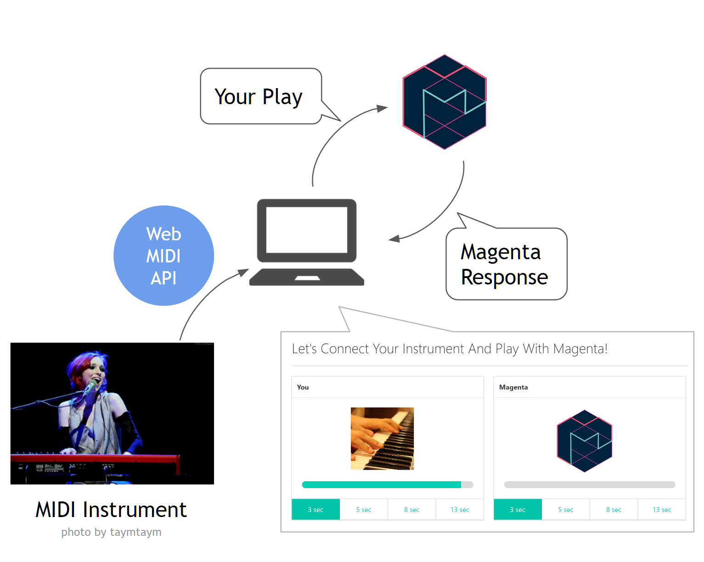

# magenta session

The code to session with [magenta](https://github.com/tensorflow/magenta).  
Do you have any MIDI instrument? If then, you can do call & response with magenta!  
(You don't have such instruments? Of course, you can play this without it!)

**You can see the sample play from here**

* [Playing Video](https://youtu.be/owOI2CMavoE)
* [Recorded Session](https://soundcloud.com/icoxfog417/magenta-sessioned-track)

(Sorry about my poor keyboard play!)

You can deploy your own Magenta Session to Heroku by following button.

[](https://heroku.com/deploy)

## Architecture



The model is ported from [ai-duet](https://github.com/googlecreativelab/aiexperiments-ai-duet).

## How to use

1. Install `magenta_session`
2. Run `python server/server.py`
3. Access the [Server(localhost:8080)](http://localhost:8080)
4. Session Now! (please refer following image).


### Additional Usage

* [Train your own model](https://github.com/icoxfog417/magenta_session/tree/master/scripts)
* [Session with your own model](https://github.com/icoxfog417/magenta_session/tree/master/server)

## Install 

`magenta_session` depends on TensorFlow and magenta.  
Please refer [magenta installation guide](https://github.com/tensorflow/magenta#installation).

### Miniconda

Install the [Miniconda](https://conda.io/miniconda.html) (Miniconda3 is also ok), and create the Magenta environment.

```
conda create -n magenta numpy scipy matplotlib jupyter 
```

(If you use Miniconda3, please set `python=2.7` additionaly when create magenta environment. Because Magenta only works on Python2!)

Then activate the `magenta` environment, and install the dependencies.

```
source activate magenta
pip install -r requirements.txt
```

**CAUTION**

* `pyenv` user will have the trouble with `source activate magenta`. To avoid this, configure your environment by `pyenv versions`, and use `pyenv local` to set the magenta environment that you created.
* `TensorFlow` does not support Windows except the Python3.5 version (and Magenta does not work on Python3.5!). So If you want to run it on Windows, you have to use [bash on Windows](https://msdn.microsoft.com/en-us/commandline/wsl/install_guide).


### Docker

Docker is an open-source containerization software which simplifies installation across various OSes.Once you have Docker installed, you can just run:

```bash
$ docker run -it --rm -p 80:8080 asashiho/magenta_session
```

If you want to build DockerImage yourself, you can just run:

```bash
$ docker build -t magenta_session .
$ docker run -it --rm -p 80:8080 magenta-session
```
**Tips!** Docker to automatically clean up the container and remove the file system when the container exits, you can add the `--rm`

You can now play with `magenta_session` at `http://<docker-server-ipaddress>/`.

Session Now and Enjoy Music!

## Dependencies

Python

* [magenta](https://github.com/tensorflow/magenta)
* [TensorFlow](https://github.com/tensorflow/tensorflow)
* [Flask](https://github.com/pallets/flask)

JavaScript

* [Tone.js](https://github.com/Tonejs/Tone.js)
* [MidiConvert](https://github.com/Tonejs/MidiConvert)
* [jQuery](https://github.com/jquery/jquery) (It's enough to such a simple application)

CSS

* [Bulma](http://bulma.io/)
